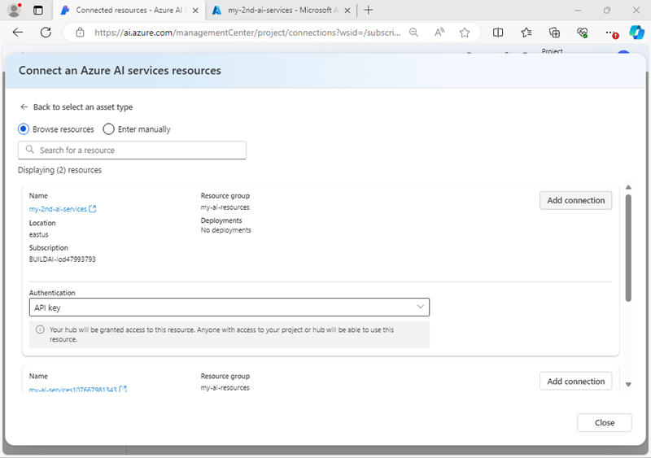

---
lab:
  title: Mempersiapkan proyek pengembangan AI
  description: Pelajari cara menata sumber daya cloud di hub dan proyek sehingga pengembang disiapkan agar sukses saat membangun solusi AI.
---

# Mempersiapkan proyek pengembangan AI

Dalam latihan ini, Anda menggunakan portal Azure AI Foundry untuk membuat hub dan proyek, siap bagi tim pengembang untuk membangun solusi AI.

Latihan ini memakan waktu sekitar **30** menit.

## Buka portal Azure AI Foundry

Mari kita mulai dengan menjelajahi portal Azure AI Foundry.

1. Di browser web, buka [portal Azure AI Foundry](https://ai.azure.com) di `https://ai.azure.com` dan masuk menggunakan kredensial Azure Anda. Tutup semua tips atau panel mulai cepat yang terbuka saat pertama kali Anda masuk, dan jika perlu, gunakan logo **Azure AI Foundry** di kiri atas untuk menavigasi ke beranda, yang tampilannya mirip dengan gambar berikut (tutup panel **Bantuan** jika terbuka):

    

1. Tinjau informasi di halaman beranda.

## Membuat hub dan proyek

*Hub* Azure AI menyediakan ruang kerja kolaboratif tempat Anda dapat menentukan satu atau beberapa *proyek*. Mari kita buat proyek dan hub Azure AI dan tinjau sumber daya Azure yang dibuat untuk mendukungnya.

1. Di beranda, pilih **+ Buat proyek**.
1. Di wizard **Buat proyek**, masukkan nama yang valid untuk proyek Anda dan jika hub yang telah ada disarankan, pilih opsi untuk membuat yang baru. Kemudian tinjau sumber daya Azure yang akan dibuat secara otomatis untuk mendukung hub dan proyek Anda.
1. Pilih **Kustomisasi** dan tentukan pengaturan berikut untuk hub Anda:
    - **Nama hub**: *Nama yang valid untuk hub Anda*
    - **Langganan**: *Langganan Azure Anda*
    - **Grup sumber daya**: *Buat atau pilih grup sumber daya*
    - **Lokasi**: Pilih **Bantu saya memilih** lalu pilih **gpt-4** di jendela pembantu Lokasi dan gunakan wilayah yang direkomendasikan\*
    - **Menyambungkan Layanan Azure AI atau Azure OpenAI**: *Membuat sumber daya Layanan AI baru*
    - **Menyambungkan Azure AI Search**: Lewati koneksi

    > \* Sumber daya Azure OpenAI dibatasi oleh kuota model regional. Jika batas kuota terlampaui di kemudian hari dalam latihan, Anda mungkin perlu membuat sumber daya lain di wilayah yang berbeda.

1. Pilih **Berikutnya** dan tinjau konfigurasi Anda. Lalu pilih **Buat** dan tunggu hingga prosesnya selesai.
1. Saat proyek Anda dibuat, tutup tips apa pun yang ditampilkan dan tinjau halaman proyek di portal Azure AI Foundry, yang akan terlihat mirip dengan gambar berikut:

    

1. Di bagian bawah panel navigasi di sebelah kiri, pilih **Pusat Manajemen**. Pusat manajemen adalah tempat Anda dapat mengonfigurasi pengaturan di tingkat *hub* dan *proyek* ; yang keduanya diperlihatkan di panel navigasi.

    

    Perhatikan bahwa di panel navigasi, Anda bisa menampilkan dan mengelola aset tingkat hub dan proyek di halaman berikut:

    - Gambaran Umum
    - Pengguna
    - Model dan titik akhir
    - Sumber daya tersambung
    - Komputasi (*hanya tingkat hub*)

    > **Catatan**: Bergantung pada izin yang ditetapkan ke ID Entra di penyewa Azure Anda, Anda mungkin tidak dapat mengelola sumber daya di tingkat hub.

1. Di panel navigasi, di bagian untuk hub Anda, pilih halaman **Gambaran Umum** untuk menampilkan detail hub Anda. 
1. Pada panel **Properti hub**, pilih tautan ke grup sumber daya yang terkait dengan hub untuk membuka tab browser baru dan melakukan navigasi ke portal Azure. Jika diminta, masuklah dengan informasi masuk Azure Anda.
1. Lihat grup sumber daya di portal Azure untuk melihat sumber daya Azure yang telah dibuat untuk mendukung hub dan proyek Anda.

    

    Perhatikan bahwa sumber daya telah dibuat di wilayah yang Anda pilih saat membuat hub.

## Menambahkan sumber daya yang tersambung

Misalkan proyek Anda memerlukan akses ke sumber daya **Layanan Azure AI** kedua di wilayah yang berbeda.

1. Pada portal Microsoft Azure, di halaman untuk grup sumber daya Anda, pilih **+ Buat** lalu cari `Azure AI Services`. Pada hasilnya, pilih sumber daya multi-layanan dari **Layanan Azure AI** seperti yang ditunjukkan pada gambar berikut:

    

1. Kemudian buat sumber daya **Layanan Azure AI** baru dengan pengaturan berikut:
    - **Langganan**: *Langganan Azure Anda*
    - **Grup sumber daya**: *Pilih grup sumber daya yang berisi sumber daya Azure AI Foundry Anda*
    - **Wilayah**: *Pilih wilayah yang tersedia selain wilayah yang berisi sumber daya Anda yang sudah ada*
    - **Nama**: *Nama yang sesuai untuk sumber daya Layanan Azure AI kedua Anda*
    - **Tingkat harga**: Standar S0
1. Tunggu hingga sumber daya Layanan AI dibuat.
1. Kembali ke tab browser portal Azure AI Foundry, dan di tampilan **Pusat manajemen**, di panel navigasi, di bagian untuk *<u>proyek Anda</u>*, lihat halaman **Sumber daya tersambung**. Sumber daya tersambung yang ada dalam proyek Anda dicantumkan.

    

1. Pilih **+ Koneksi baru** dan pilih jenis sumber daya **Layanan Azure AI**. Selanjutnya, telusuri sumber daya yang tersedia untuk menemukan sumber daya Layanan AI yang Anda buat di portal Azure, lalu gunakan tombol **Tambahkan Koneksi** untuk menambahkannya ke proyek Anda.

    

1. Saat sumber daya baru tersambung, tutup kotak dialog **Sambungkan sumber daya layanan Azure AI** dan verifikasi bahwa sumber daya terhubung yang baru untuk Layanan Azure AI dan Azure OpenAI Service tercantum.

## Jelajahi Layanan Azure AI

Proyek Azure AI Foundry Anda memiliki akses ke Layanan Azure AI. Mari kita coba di portal.

1. Di halaman Pusat manajemen, di panel navigasi, di bawah proyek Anda, pilih **Buka proyek**.
1. Di panel navigasi untuk proyek Anda, pilih **Layanan AI** dan pilih petak peta **Bahasa dan Penerjemah** .

    

1. Di bagian **Jelajahi Kemampuan bahasa**, lihat tab **Terjemahan** dan pilih **Terjemahan teks**.

    

1. Di halaman **Terjemahan teks**, di bagian **Cobalah**, lihat tab **Coba dengan tab Anda sendiri** .
1. Pilih salah satu sumber daya Layanan Azure AI Anda lalu coba terjemahkan beberapa teks (misalnya, `Hello world`) dari satu bahasa ke bahasa lain.

    

## Menyebarkan dan menguji model AI generatif

Proyek Anda juga berisi sumber daya yang terhubung untuk Azure OpenAI, yang memungkinkan Anda menggunakan model bahasa Azure OpenAI untuk menerapkan solusi AI generatif. Anda juga dapat menemukan dan menggunakan model AI generatif dari vendor lain dalam katalog model.

1. Di panel sebelah kiri untuk proyek Anda, di bagian **Aset saya**, pilih halaman **Model + titik akhir**.
1. Pada halaman **Model + titik akhir** , di tab **Penyebaran model** di menu **+ Sebarkan model** pilih **Sebarkan model dasar**.
1. Cari model **gpt-4o** dari daftar, pilih dan konfirmasi.
1. Terapkan model dengan pengaturan berikut dengan memilih **Sesuaikan** di detail penyeberan:
    - **Nama penyebaran**: *Nama yang valid untuk penyebaran model Anda*
    - **Tipe penyebaran**: Standar Global
    - **Pembaruan versi otomatis**: Diaktifkan
    - **Versi model**: *Pilih versi terbaru yang tersedia*
    - **Sumber daya AI yang terhubung**: *Pilih koneksi sumber daya Azure OpenAI Anda*
    - **Batas Rate Token per Menit (ribuan)**: 50K *(atau jumlah maksimum yang tersedia dalam langganan Anda jika kurang dari 50K)*
    - **Filter konten**: DefaultV2

    > **Catatan**: Mengurangi TPM membantu menghindari penggunaan berlebih kuota yang tersedia dalam langganan yang Anda gunakan. 50.000 TPM seharusnya cukup untuk data yang digunakan dalam latihan ini. Jika kuota yang tersedia lebih rendah dari ini, Anda akan dapat menyelesaikan latihan tetapi Anda mungkin mengalami kesalahan jika batas rate terlampaui.

1. Tunggu hingga penerapan selesai.

1. Setelah model disebarkan, di halaman gambaran umum penyebaran, pilih **Buka di playground**.
1. Di halaman **obrolan playground** pastikan bahwa penyebaran model Anda dipilih di bagian **Penyebaran** .
1. Di panel **Penyiapan** , dalam kotak **Give the model instructions and context**, masukkan instruksi berikut ini:

    ```
    You are a history teacher who can answer questions about past events all around the world.
    ```

1. Terapkan perubahan untuk memperbarui pesan sistem.
1. Di jendela obrolan, masukkan kueri seperti `What are the key events in the history of Scotland?` dan lihat responsnya:

    

## Ringkasan

Dalam latihan ini, Anda telah menjelajahi Azure AI Foundry, dan melihat cara membuat dan mengelola hub dan proyek, menambahkan sumber daya yang terhubung, dan menjelajahi Layanan Azure AI dan model Azure OpenAI di portal Azure AI Foundry.

## Penghapusan

Setelah selesai menjelajahi Azure AI Foundry, Anda harus menghapus sumber daya yang telah Anda buat di latihan ini untuk menghindari biaya Azure yang tidak perlu.

1. Kembali ke tab browser yang berisi portal Azure (atau buka kembali [portal Azure](https://portal.azure.com) di `https://portal.azure.com` tab browser baru) dan lihat konten grup sumber daya tempat Anda menyebarkan sumber daya yang digunakan dalam latihan ini.
1. Pada toolbar pilih **Hapus grup sumber daya**.
1. Masukkan nama grup sumber daya untuk mengonfirmasi bahwa Anda ingin menghapusnya, dan pilih Hapus.
