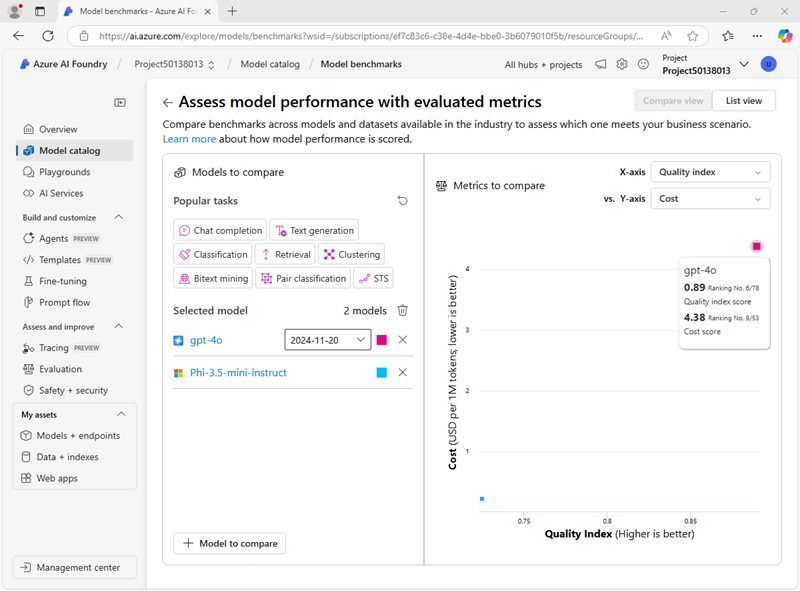

---
lab:
  title: Memilih dan menyebarkan model bahasa
  description: Aplikasi AI generatif dibangun di atas satu atau beberapa model bahasa. Pelajari cara menemukan dan memilih model yang tepat untuk proyek AI generatif Anda.
---

# Memilih dan menyebarkan model bahasa

Katalog model Azure AI Foundry berfungsi sebagai repositori pusat tempat Anda dapat menjelajahi dan menggunakan berbagai model, memfasilitasi pembuatan skenario AI generatif Anda.

Dalam latihan ini, Anda akan menjelajahi katalog model di portal Azure AI Foundry, dan membandingkan model potensial untuk aplikasi AI generatif yang membantu memecahkan masalah.

Latihan ini akan memakan waktu sekitar **25** menit.

> **Catatan**: Beberapa teknologi yang digunakan dalam latihan ini sedang dalam pratinjau atau dalam pengembangan aktif. Anda mungkin mengalami beberapa perilaku, peringatan, atau kesalahan yang tidak terduga.

## Membuat hub dan proyek Azure AI

Hub Azure AI menyediakan ruang kerja kolaboratif tempat Anda dapat menentukan satu atau beberapa *proyek*. Mari kita buat proyek dan hub Azure AI.

1. Di browser web, buka [portal Azure AI Foundry](https://ai.azure.com) di `https://ai.azure.com` dan masuk menggunakan kredensial Azure Anda. Tutup semua tips atau panel mulai cepat yang terbuka saat pertama kali Anda masuk, dan jika perlu, gunakan logo **Azure AI Foundry** di kiri atas untuk menavigasi ke beranda, yang tampilannya mirip dengan gambar berikut (tutup panel **Bantuan** jika terbuka):

    

1. Di beranda, pilih **+ Buat proyek**.
1. Di wizard **Buat proyek**, masukkan nama yang valid untuk proyek Anda dan jika hub yang telah ada disarankan, pilih opsi untuk membuat yang baru. Kemudian tinjau sumber daya Azure yang akan dibuat secara otomatis untuk mendukung hub dan proyek Anda.
1. Pilih **Kustomisasi** dan tentukan pengaturan berikut untuk hub Anda:
    - **Nama hub**: *Nama yang valid untuk hub Anda*
    - **Langganan**: *Langganan Azure Anda*
    - **Grup sumber daya**: *Buat atau pilih grup sumber daya*
    - **Lokasi**: Pilih **Bantu saya memilih** lalu pilih **gpt-4o** di jendela pembantu Lokasi dan gunakan wilayah yang direkomendasikan\*
    - **Menyambungkan Layanan Azure AI atau Azure OpenAI**: *Membuat sumber daya Layanan AI baru*
    - **Menyambungkan Azure AI Search**: Lewati koneksi

    > \* Sumber daya Azure OpenAI dibatasi oleh kuota model regional. Jika batas kuota terlampaui di kemudian hari dalam latihan, Anda mungkin perlu membuat sumber daya lain di wilayah yang berbeda.

1. Pilih **Berikutnya** dan tinjau konfigurasi Anda. Lalu pilih **Buat** dan tunggu hingga prosesnya selesai.
1. Saat proyek Anda dibuat, tutup tips apa pun yang ditampilkan dan tinjau halaman proyek di portal Azure AI Foundry, yang akan terlihat mirip dengan gambar berikut:

    

## Mengkonfigurasi penyebaran layanan Inferensi Azure AI

Ada beberapa opsi untuk menyebarkan model di portal Azure AI Foundry. Dalam latihan ini, Anda akan menggunakan opsi penyebaran **inferensi model Azure AI**, yang mendukung model *Azure OpenAI* dan model-model *Model sebagai layanan* dari katalog model Azure AI Foundry. Karena semua model disebarkan ke titik akhir umum yang dihosting oleh sumber daya Layanan Azure AI Anda, mudah untuk beralih antar model saat mengujinya untuk membandingkan perilaku dan performa.

1. Di toolbar di kanan atas halaman proyek Azure AI Foundry Anda, gunakan ikon **Fitur Pratinjau** **&#9215;**) untuk menampilkan fitur pratinjau.
1. Verifikasi bahwa fitur **Layanan Penyebaran model ke interfensi model Azure AI diaktifkan **. Kemudian tutup panel **fitur Pratinjau**.

## Meninjau detail dan tolak ukur model

Untuk membantu Anda memilih model, Anda dapat menjelajahi deskripsi model dan tolak ukur untuk menentukan model mana yang paling sesuai dengan kebutuhan Anda.

1. Di portal proyek Azure AI Foundry, pada panel navigasi di sebelah kiri, pilih **Katalog model**.
1. Di laman beranda katalog model, cari untuk `gpt-4o`menemukan model penyelesaian obrolan **gpt-4o**.

    

1. Pilih model **gpt-4o** dan lihat detailnya. Baca deskripsi dan tinjau informasi lain yang tersedia di halaman.

    

1. Pada halaman **gpt-4o**, lihat tab **Benchmarks** untuk melihat bagaimana model tersebut dibandingkan pada beberapa tolak ukur performa standar dengan model lain yang digunakan dalam skenario serupa.

    

1. Gunakan panah belakang (**&larr;**) di samping judul halaman **gpt-4o** untuk kembali ke beranda katalog model.
1. Dalam katalog model, cari `Phi-3.5-mini-instruct` dan lihat detail dan tolak ukur untuk **Phi-3.5-mini-instruct**.

## Membandingkan beberapa model

Anda telah meninjau dua model berbeda, yang keduanya dapat digunakan untuk mengimplementasikan aplikasi obrolan AI generatif. Sekarang mari kita bandingkan metrik untuk kedua model ini secara visual.

1. Kembali ke beranda **Katalog model**.
1. Pilih **Bandingkan model**. Bagan visual untuk perbandingan model ditampilkan dengan pilihan model umum.

    

1. Di panel **Model untuk dibandingkan** di sebelah kiri, perhatikan bahwa Anda bisa memilih tugas populer, seperti *jawaban atas pertanyaan* untuk memilih model yang umum digunakan secara otomatis untuk tugas tertentu.
1. Gunakan ikon **Hapus semua model** (&#128465;) untuk menghapus semua model yang telah dipilih sebelumnya.
1. Gunakan tombol **+ Model untuk membandingkan** untuk menambahkan model **gpt-4o** ke dalam daftar. Kemudian gunakan tombol yang sama untuk menambahkan model **Phi-3.5-mini-instruct** ke daftar.
1. Tinjau bagan, yang membandingkan model berdasarkan **Indeks Kualitas** (skor standar yang menunjukkan kualitas model) dan **Biaya**. Anda dapat melihat nilai tertentu untuk model dengan menahan mouse di atas titik yang mewakilinya dalam bagan.

    

1. Di menu dropdown **Sumbu-X**, di bawah **Kualitas**, pilih metrik berikut dan amati setiap bagan yang dihasilkan sebelum beralih ke bagan berikutnya:
    - Akurasi
    - Koherensi
    - Kelancaran
    - Relevansi

## Terapkan model

Sekarang setelah Anda menjelajahi opsi Anda melalui tolok ukur model, Anda siap untuk menyebarkan model bahasa. Anda dapat menelusuri katalog model, dan menyebarkan dari sana, atau Anda dapat menyebarkan model melalui halaman **Penyebaran** . Mari kita jelajahi kedua opsi tersebut.

### Menyebarkan model dari *katalog Model*

Mari kita mulai dengan menyebarkan model dari katalog Model. Anda mungkin lebih suka opsi ini ketika Anda ingin memfilter semua model yang tersedia.

1. Kembali ke beranda **Katalog model**.
1. Cari dan pilih `gpt-4o` model, seperti yang Anda lakukan sebelumnya.
1. Pada halaman **gpt-4o**, pilih**Deploy** dan sebarkan model dengan pengaturan berikut dengan memilih **Customize** di rincian penyebaran:
1. Terapkan model dengan pengaturan berikut dengan memilih **Sesuaikan** di detail penyeberan:
    - **Nama penyebaran**: *Nama yang valid untuk penyebaran model Anda*
    - **Tipe penyebaran**: Standar Global
    - **Pembaruan versi otomatis**: Diaktifkan
    - **Versi model**: *Pilih versi terbaru yang tersedia*
    - **Sumber daya AI yang terhubung**: *Pilih koneksi sumber daya Azure OpenAI Anda*
    - **Batas Rate Token per Menit (ribuan)**: 50K *(atau jumlah maksimum yang tersedia dalam langganan Anda jika kurang dari 50K)*
    - **Filter konten**: DefaultV2

    > **Catatan**: Mengurangi TPM membantu menghindari penggunaan berlebih kuota yang tersedia dalam langganan yang Anda gunakan. 50.000 TPM seharusnya cukup untuk data yang digunakan dalam latihan ini. Jika kuota yang tersedia lebih rendah dari ini, Anda akan dapat menyelesaikan latihan tersebut tetapi Anda mungkin perlu menunggu dan mengirim ulang perintah jika batas rate terlampaui.

1. Tunggu hingga penerapan selesai.

### Menerapkan model melalui *Model + titik akhir*

Jika Anda sudah mengetahui dengan pasti model mana yang ingin Anda terapkan, Anda mungkin lebih suka melakukannya melalui **Models + titik akhir**.

1. Di panel navigasi di sebelah kiri, di bawah **Aset saya**, pilih halaman **Model + titik akhir**.
1. Di tab **Penyebaran model**, di daftar drop-down **+ Sebarkan model**, pilih **Sebarkan model dasar**. Kemudian cari `Phi-3.5-mini-instruct` dan konfirmasikan pilihan Anda.
1. Setujui lisensi model.
1. Sebarkan model **Phi-3.5-mini-instruct** dengan pengaturan berikut:
    - **Nama penyebaran**: *Nama yang valid untuk penyebaran model Anda*
    - **Tipe penyebaran**: Standar Global
    - **Detail penyebaran**: *Gunakan pengaturan default*

1. Tunggu hingga penerapan selesai.

## Menguji model di taman bermain obrolan

Sekarang setelah kita memiliki dua model untuk dibandingkan, mari kita lihat bagaimana model bersikap dalam interaksi percakapan.

### Bersiap untuk mengobrol

1. Di bilah navigasi, pilih **Playground**. Lalu pilih **Playground obrolan**.
1. Di panel **Penyiapan**, di **bidang Berikan instruksi dan konteks** model, atur perintah sistem ke `You are an AI assistant that helps solve problems.`
1. Pilih **Terapkan perubahan**.

### Mengobrol dengan model *gpt-4o*

Di panel **Penyiapan**, pilih model *gpt-4o* Anda.
1. Di jendela kueri, masukkan kueri berikut ini

    ```
    I have a fox, a chicken, and a bag of grain that I need to take over a river in a boat. I can only take one thing at a time. If I leave the chicken and the grain unattended, the chicken will eat the grain. If I leave the fox and the chicken unattended, the fox will eat the chicken. How can I get all three things across the river without anything being eaten?
    ```

1. Tampilkan responsnya. Lalu masukkan kueri susulan berikut:

    ```
    Explain your reasoning.
    ```

### Mengobrol dengan model *Phi-3.5*

1. Di panel **Penyiapan**, pilih model *Phi-3.5* Anda.
1. Pastikan bahwa sesi obrolan baru dimulai sebelum mengulangi perintah yang sama yang sebelumnya Anda gunakan untuk menguji model gpt-4.
1. Di jendela kueri, masukkan kueri berikut ini

    ```
    I have a fox, a chicken, and a bag of grain that I need to take over a river in a boat. I can only take one thing at a time. If I leave the chicken and the grain unattended, the chicken will eat the grain. If I leave the fox and the chicken unattended, the fox will eat the chicken. How can I get all three things across the river without anything being eaten?
    ```

1. Tampilkan responsnya. Lalu masukkan kueri susulan berikut:

    ```
    Explain your reasoning.
    ```

### Melakukan perbandingan lebih lanjut

1. Cobalah teka-teki berikut dengan kedua model, meminta model untuk menjelaskan penalaran mereka (jawaban yang benar adalah 40!):

    ```
    I have 53 socks in my drawer: 21 identical blue, 15 identical black and 17 identical red. The lights are out, and it is completely dark. How many socks must I take out to make 100 percent certain I have at least one pair of black socks?
    ```

## Cermati model-modelnya

Anda telah membandingkan dua model, yang mungkin bervariasi dalam hal kemampuannya untuk menghasilkan respons yang sesuai dan biayanya. Dalam skenario generatif apa pun, Anda perlu menemukan model dengan keseimbangan yang tepat antara kesesuaian untuk tugas yang perlu Anda lakukan dan biaya penggunaan model untuk jumlah permintaan yang Anda harapkan harus ditangani.

Detail dan tolak ukur yang disediakan dalam katalog model, bersama dengan kemampuan untuk membandingkan model secara visual memberikan titik awal yang berguna saat mengidentifikasi model kandidat untuk solusi AI generatif. Anda kemudian dapat menguji model kandidat dengan berbagai perintah sistem dan pengguna di playground obrolan.

## Penghapusan

Setelah selesai menjelajahi Azure AI Foundry, Anda harus menghapus sumber daya yang telah Anda buat di latihan ini untuk menghindari biaya Azure yang tidak perlu.

1. Buka [portal Azure](https://portal.azure.com) dan lihat konten grup sumber daya tempat Anda menyebarkan sumber daya yang digunakan dalam latihan ini.
1. Pada toolbar pilih **Hapus grup sumber daya**.
1. Masukkan nama grup sumber daya untuk mengonfirmasi bahwa Anda ingin menghapusnya, dan pilih Hapus.
