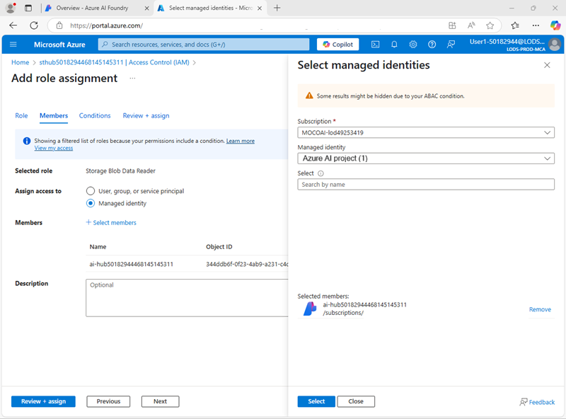

---
lab:
  title: Menggunakan alur perintah untuk mengelola percakapan di aplikasi obrolan
  description: Pelajari cara menggunakan alur perintah untuk mengelola dialog percakapan dan memastikan bahwa perintah dibuat dan diatur untuk hasil terbaik.
---

## Menggunakan alur perintah untuk mengelola percakapan di aplikasi obrolan

Dalam latihan ini, Anda akan menggunakan alur perintah portal Azure AI Foundry untuk membuat aplikasi obrolan khusus yang menggunakan perintah pengguna dan riwayat obrolan sebagai input, lalu menggunakan model GPT dari Azure OpenAI untuk menghasilkan keluaran.

Latihan ini akan memakan waktu sekitar **30** menit.

> **Catatan**: Beberapa teknologi yang digunakan dalam latihan ini sedang dalam pratinjau atau dalam pengembangan aktif. Anda mungkin mengalami beberapa perilaku, peringatan, atau kesalahan yang tidak terduga.

## Membuat pusat penyimpanan AI dan proyek di Azure AI Foundry

Fitur Azure AI Foundry yang akan kita gunakan dalam latihan ini memerlukan proyek yang didasarkan pada sumber daya *hub* Azure AI Foundry.

1. Di browser web, buka [portal Azure AI Foundry](https://ai.azure.com) di `https://ai.azure.com` dan masuk menggunakan kredensial Azure Anda. Tutup semua tips atau panel mulai cepat yang terbuka saat pertama kali Anda masuk, dan jika perlu, gunakan logo **Azure AI Foundry** di kiri atas untuk menavigasi ke beranda, yang tampilannya mirip dengan gambar berikut (tutup panel **Bantuan** jika terbuka):

    

1. Di browser, navigasikan ke `https://ai.azure.com/managementCenter/allResources`dan pilih **Create**. Lalu pilih opsi untuk membuat **sumber daya hub AI** baru.
1. Dalam wizard **Create a project**, masukkan nama yang valid untuk proyek Anda, dan jika disarankan hub yang sudah ada, pilih opsi untuk membuat yang baru dan perluas **Advanced options** dalam menentukan pengaturan berikut untuk proyek Anda:
    - **Langganan**: *Langganan Azure Anda*
    - **Grup sumber daya**: *Buat atau pilih grup sumber daya*
    - **Nama hub**: Nama yang valid untuk hub Anda
    - **Lokasi**: AS Timur 2 atau Swedia Tengah (*Jika kemudian terjadi batas kuota telampau saat latihan, Anda mungkin perlu membuat sumber daya lain di wilayah yang berbeda*)

    > **Catatan**: Jika Anda bekerja dengan berlangganan Azure di mana kebijakan digunakan untuk membatasi nama sumber daya yang diizinkan, Anda mungkin perlu menggunakan tautan di bagian bawah kotak dialog **Buat proyek baru** untuk membuat hub menggunakan portal Azure.

    > **Tips**: Jika tombol **Buat** masih dinonaktifkan, pastikan untuk mengganti nama hub Anda menjadi nilai alfanumerik unik.

1. Tunggu proyek Anda dibuat.

## Mengonfigurasi otorisasi sumber daya

Alat alur prompt di Azure AI Foundry membuat aset berbasis file yang menentukan alur prompt dalam folder di blob storage. Sebelum menjelajahi alur perintah, mari pastikan bahwa sumber daya Layanan Azure AI Anda memiliki akses yang diperlukan ke penyimpanan blob agar dapat dibaca.

1. Di tab peramban baru, buka [portal Azure](https://portal.azure.com) di `https://portal.azure.com`, masuk dengan kredensial Azure Anda jika diminta; dan lihat grup sumber daya yang berisi sumber daya pusat penyimpanan Azure AI Anda.
1. Pilih sumber daya **Azure AI Foundry**pusat penyimpanan Anda untuk membukanya. Kemudian perluas bagian **Manajemen Sumber Daya** dan pilih halaman **Identitas**:

    

1. Jika status identitas yang ditetapkan sistem dalam keadaan **Nonaktif**, alihkan ke **Aktif** dan simpan perubahan Anda. Kemudian tunggu hingga perubahan status dikonfirmasi.
1. Kembali ke halaman grup sumber daya, lalu pilih **Akun penyimpanan** untuk hub Anda dan lihat halaman **Access Control (IAM)**:

    

1. Tambahkan penetapan peran ke`Storage blob data reader` peran untuk identitas terkelola yang digunakan oleh sumber daya Layanan Azure AI Anda:

    

1. Saat Anda telah meninjau dan menetapkan akses peran untuk mengizinkan identitas yang dikelola Azure AI Foundry untuk membaca blob di akun penyimpanan, tutup tab portal Azure dan kembali ke portal Azure AI Foundry.

## Menyebarkan model AI generatif

Sekarang Anda telah siap untuk menyebarkan model bahasa AI generatif untuk mendukung aplikasi alur prompt Anda.

1. Di panel sebelah kiri untuk proyek Anda, di bagian **Aset saya**, pilih halaman **Model + titik akhir**.
1. Pada halaman **Model + titik akhir** , di tab **Penyebaran model** di menu **+ Sebarkan model** pilih **Sebarkan model dasar**.
1. Cari model **gpt-4o** dari daftar, pilih dan konfirmasi.
1. Terapkan model dengan pengaturan berikut dengan memilih **Sesuaikan** di detail penyeberan:
    - **Nama penyebaran**: *Nama yang valid untuk penyebaran model Anda*
    - **Tipe penyebaran**: Standar Global
    - **Pembaruan versi otomatis**: Diaktifkan
    - **Versi model**: *Pilih versi terbaru yang tersedia*
    - **Sumber daya AI yang terhubung**: *Pilih koneksi sumber daya Azure OpenAI Anda*
    - **Batas Rate Token per Menit (ribuan)**: 50K *(atau jumlah maksimum yang tersedia dalam langganan Anda jika kurang dari 50K)*
    - **Filter konten**: DefaultV2

    > **Catatan**: Mengurangi TPM membantu menghindari penggunaan berlebih kuota yang tersedia dalam langganan yang Anda gunakan. 50.000 TPM seharusnya cukup untuk data yang digunakan dalam latihan ini. Jika kuota yang tersedia lebih rendah dari ini, Anda akan dapat menyelesaikan latihan tetapi Anda mungkin mengalami kesalahan jika batas rate terlampaui.

1. Tunggu hingga penerapan selesai.

## Membuat alur prompt

Alur prompt menyediakan cara untuk mengatur perintah dan aktivitas lain untuk menentukan interaksi dengan model AI generatif. Dalam latihan ini, Anda akan menggunakan templat untuk membuat alur obrolan dasar untuk asisten AI di agen perjalanan.

1. Di bilah navigasi portal Azure AI Foundry, di bagian **Buat dan sesuaikan**, pilih **Alur prompt **.
1. Buat alur baru berdasarkan templat **Alur obrolan**, tentukan`Travel-Chat` sebagai nama folder.

    Alur obrolan sederhana dibuat untuk Anda.

    > **Tips**: Jika terjadi kesalahan izin. Tunggu beberapa menit dan coba lagi, tentukan nama alur yang berbeda jika perlu.

1. Untuk dapat menguji alur Anda, Anda memerlukan komputasi, dan mungkin perlu waktu beberapa saat untuk memulainya; jadi pilih **Start compute session** untuk memulainya saat Anda menjelajahi dan memodifikasi alur default.

1. Lihat alur prompt, yang terdiri dari serangkaian *input*, *output*, dan *alat*. Anda dapat memperluas dan mengedit properti objek ini di panel pengeditan di sebelah kiri, dan menampilkan keseluruhan alur sebagai grafik di sebelah kanan:

    

1. Lihat panel **Input**, dan perhatikan bahwa ada dua input (riwayat obrolan dan pertanyaan pengguna)
1. Lihat panel **Output** dan perhatikan bahwa ada output yang mencerminkan jawaban model.
1. Lihat panel alat LLM **Obrolan**, yang berisi informasi yang diperlukan untuk mengirimkan perintah ke model.
1. Di panel alat LLM **Obrolan**, untuk **Koneksi**, pilih koneksi untuk sumber daya layanan Azure OpenAI di hub AI Anda. Kemudian konfigurasikan properti koneksi berikut:
    - **Api**: obrolan
    - **deployment_name**: *Model gpt-4o yang Anda sebarkan*
    - **format_respon**: {"type":"text"}
1. Ubah bidang **Prompt** sebagai berikut:

   ```yml
   # system:
   **Objective**: Assist users with travel-related inquiries, offering tips, advice, and recommendations as a knowledgeable travel agent.

   **Capabilities**:
   - Provide up-to-date travel information, including destinations, accommodations, transportation, and local attractions.
   - Offer personalized travel suggestions based on user preferences, budget, and travel dates.
   - Share tips on packing, safety, and navigating travel disruptions.
   - Help with itinerary planning, including optimal routes and must-see landmarks.
   - Answer common travel questions and provide solutions to potential travel issues.

   **Instructions**:
   1. Engage with the user in a friendly and professional manner, as a travel agent would.
   2. Use available resources to provide accurate and relevant travel information.
   3. Tailor responses to the user's specific travel needs and interests.
   4. Ensure recommendations are practical and consider the user's safety and comfort.
   5. Encourage the user to ask follow-up questions for further assistance.

   
   # user:
   {{item.inputs.question}}
   # assistant:
   {{item.outputs.answer}}
   

   # user:
   {{question}}
   ```

    Baca perintah yang Anda tambahkan sehingga Anda terbiasa dengannya. Ini terdiri dari pesan sistem (yang mencakup tujuan, definisi kemampuannya, dan beberapa instruksi), dan riwayat obrolan (diurutkan untuk menampilkan setiap input pertanyaan pengguna dan setiap output jawaban asisten sebelumnya)

1. Di bagian **Input** untuk alat LLM **OBROLAN** (di bawah perintah), pastikan variabel berikut diatur:
    - **pertanyaan** (string): ${inputs.question}
    - **chat_history** (string): ${inputs.chat_history}

1. Simpan perubahan pada alur.

    > **Catatan**: Dalam latihan ini, kita akan menggunakan alur obrolan sederhana, tetapi perhatikan bahwa editor alur prompt menyertakan banyak alat lain yang dapat Anda tambahkan ke alur, yang memungkinkan Anda membuat logika kompleks untuk mengatur percakapan.

## Uji aliran

Sekarang setelah mengembangkan alur, Anda dapat menggunakan jendela obrolan untuk mengujinya.

1. Pastikan sesi komputasi berjalan. Jika tidak, tunggu hingga dimulai.
1. Pada toolbar, pilih **Obrolan** untuk membuka panel **Obrolan** , dan tunggu hingga obrolan diinisialisasi.
1. Masukkan kueri: `I have one day in London, what should I do?` dan tinjau output. Panel Obrolan ini akan terlihat seperti ini:

    

## Sebarkan alur

Saat Anda puas dengan perilaku alur yang Anda buat, Anda dapat menyebarkan alur.

> **Catatan**: Penyebaran dapat memakan waktu lama, dan dapat dipengaruhi oleh batasan kapasitas di langganan atau penyewa Anda.

1. Pada toolbar, pilih **Deploy**, lalu sebarkan alur dengan pengaturan berikut:
    - **Pengaturan dasar**:
        - **Titik akhir**: Baru
        - **Nama titik akhir**: *Masukkan nama unik*
        - **Nama penyebaran**: *Masukkan nama yang unik*
        - **Komputer virtual**: Standard_DS3_v2
        - **Jumlah instans**: 1
        - **Inferensi pengumpulan data**: Dinonaktifkan
    - **Pengaturan tingkat lanjut**:
        - *Menjaga pengaturan default*
1. Di portal Azure AI Foundry, di panel navigasi, di bagian **My assets**, pilih halaman **Models + endpoints**.

    Jika halaman terbuka untuk model gpt-4o Anda, gunakan tombol **kembali** untuk melihat semua model dan endpoint.

1. Awalnya, halaman mungkin hanya dapat menampilkan penyebaran model Anda. Mungkin perlu waktu sebelum penyebaran dicantumkan, dan bahkan lebih lama lagi sebelum berhasil dibuat.
1. Ketika penyebaran telah *berhasil*, pilih penyebaran tersebut. Kemudian, lihat halaman **Test**.

    > **Tips**: Jika halaman pengujian menggambarkan endpoint sebagai tidak sehat, kembali ke **models and endpoints** dan tunggu sekitar satu menit sebelum me-refresh tampilan dan memilih endpoint lagi.

1. Masukkan perintah `What is there to do in San Francisco?` dan tinjau responsnya.
1. Masukkan perintah `Tell me something about the history of the city.` dan tinjau responsnya.

    Panel pengujian akan terlihat seperti ini:

    

1. Lihat halaman **Konsumsi** untuk endpoint, dan perhatikan bahwa halaman tersebut berisi informasi koneksi dan kode sampel yang dapat Anda gunakan untuk membangun aplikasi klien untuk endpoint Anda - memungkinkan Anda mengintegrasikan solusi alur prompt ke dalam aplikasi sebagai aplikasi AI generatif.

## Penghapusan

Setelah selesai menjelajahi alur prompt, Anda harus menghapus sumber daya yang telah Anda buat untuk menghindari biaya Azure yang tidak perlu.

- Navigasikan ke [portal Microsoft Azure](https://portal.azure.com) di `https://portal.azure.com`.
- Di portal Microsoft Azure, pada halaman **Beranda**, pilih **Grup sumber daya**.
- Pilih grup sumber daya yang telah Anda buat untuk latihan ini.
- Di bagian atas halaman **Gambaran Umum** untuk grup sumber daya, pilih **Hapus grup sumber daya**.
- Masukkan nama grup sumber daya untuk mengonfirmasi bahwa Anda ingin menghapusnya, dan pilih **Hapus**.
