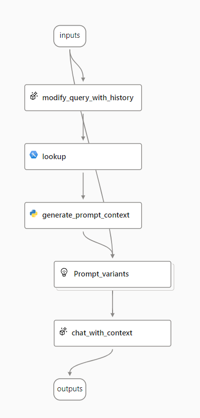

---
lab:
  title: Membuat aplikasi AI generatif yang menggunakan data Anda sendiri
  description: Pelajari cara menggunakan model Retrieval Augmented Generation (RAG) untuk membuat aplikasi obrolan yang mendasarkan perintah dengan menggunakan data Anda sendiri.
---

# Membuat aplikasi AI generatif yang menggunakan data Anda sendiri

Retrieval Augmented Generation (RAG) adalah teknik yang digunakan untuk membangun aplikasi yang mengintegrasikan data dari sumber data kustom ke dalam permintaan untuk model AI generatif. RAG adalah pola yang umum digunakan untuk mengembangkan aplikasi AI generatif - aplikasi berbasis obrolan yang menggunakan model bahasa untuk menafsirkan input dan menghasilkan respons yang sesuai.

Dalam latihan ini, Anda akan menggunakan Azure AI Foundry untuk mengintegrasikan data kustom ke dalam alur permintaan AI generatif.

Latihan ini memakan waktu sekitar **45** menit.

## Membuat sumber daya  Pencarian Azure AI

Solusi aplikasi AI generatif Anda akan memadukan data khusus ke dalam alur yang cepat. Untuk mendukung integrasi ini, Anda memerlukan sumber daya Azure AI Search untuk mengindeks data Anda.

1. Di browser web, buka [portal Azure](https://portal.azure.com) di `https://portal.azure.com` dan masuk menggunakan kredensial Azure Anda.
1. Di halaman beranda **+ Buat sumber daya** dan pencarian `Azure AI Search`. Kemudian buat sumber daya Azure AI Search baru dengan pengaturan berikut:

    - **Langganan**: *Pilih langganan Azure Anda*
    - **Grup sumber daya**: *Memilih atau membuat grup sumber daya*
    - **Nama layanan**: *Masukkan nama yang unik*
    - **Lokasi**: *Buat **pilihan acak** dari salah satu wilayah berikut*\*
        - Australia Timur
        - Kanada Timur
        - AS Timur
        - AS Timur 2
        - Prancis Tengah
        - Jepang Timur
        - AS Tengah Bagian Utara
        - Swedia Tengah
        - Swiss 
    - **Tingkat harga**: Standar

    > \* Nantinya, Anda akan membuat Azure AI Hub (yang menyertakan layanan Azure OpenAI) di wilayah yang sama dengan sumber daya Azure AI Search Anda. Sumber daya Azure OpenAI dibatasi oleh kuota regional. Wilayah yang tercantum mencakup kuota default untuk tipe model yang digunakan dalam latihan ini. Memilih wilayah secara acak akan mengurangi risiko satu wilayah mencapai batas kuota dalam skenario di mana Anda berbagi langganan dengan pengguna lain. Jika batas kuota tercapai di akhir latihan, Anda mungkin perlu membuat Azure AI hub lain di wilayah yang berbeda.

1. Tunggu hingga penyebaran Azure AI Search Anda selesai.

## Membuat proyek Azure OpenAI

Sekarang Anda siap untuk membuat proyek Azure AI Foundry dan sumber daya Azure AI untuk mendukungnya.

1. Di browser web, buka portal [Azure AI Foundry](https://ai.azure.com) di `https://ai.azure.com` dan masuk menggunakan kredensial Azure Anda.
1. Di beranda, pilih **+ Buat proyek**.
1. Di wizard **Buat proyek**, Anda bisa melihat semua sumber daya Azure yang akan dibuat secara otomatis dengan proyek Anda. Pilih **Kustomisasi** dan sambungkan ke sumber daya Azure AI Search Anda:

    - **Nama hub**: *Nama unik*
    - **Langganan Azure**: *Langganan Azure Anda*.
    - **Grup sumber daya**: *Pilih grup sumber daya yang berisi sumber daya Azure AI Search Anda*
    - **Lokasi**: *Pilih lokasi yang sama dengan sumber daya Azure AI Search Anda*
    - **Sambungkan Layanan Azure AI atau Azure OpenAI**: (Baru) *Autofills dengan nama hub yang Anda pilih*
    - **Sambungkan Pencarian Azure AI**: *pilih sumber daya Pencarian Azure AI Anda*

1. Pilih **Berikutnya** dan tinjau konfigurasi Anda.
1. Pilih **Buat** dan tunggu hingga prosesnya selesai.
   
## Terapkan model

Anda memerlukan dua model untuk mengimplementasikan solusi Anda:

- Model *penyematan* untuk memvektorisasi data teks untuk pengindeksan dan pemrosesan yang efisien.
- Model yang dapat menghasilkan respons bahasa alami terhadap pertanyaan berdasarkan data Anda.

1. Di portal Azure AI Foundry, di proyek Anda, di panel navigasi di sebelah kiri, di bawah **Aset saya**, pilih halaman **Model + titik akhir**.
1. Buat penyebaran baru model **text-embedding-ada-002** dengan pengaturan berikut dengan memilih **Sesuaikan** di wizard Penerapan model:

    - **Nama penyebaran**: `text-embedding-ada-002`
    - **Tipe penyebaran**: Standar
    - **Versi model**: *Pilih versi default*
    - **Sumber daya AI**: *Pilih sumber daya yang dibuat sebelumnya*
    - **Batas Tarif Token Per Menit (ribuan)**: 5K
    - **Filter konten**: DefaultV2
    - **Aktifkan kuota dinamis**: Dinonaktifkan

    > **Catatan**: Jika lokasi sumber daya AI Anda saat ini tidak memiliki kuota yang tersedia untuk model yang ingin Anda terapkan, Anda akan diminta untuk memilih lokasi lain tempat sumber daya AI baru akan dibuat dan tersambung ke proyek Anda.

1. Ulangi langkah-langkah sebelumnya untuk menyebarkan model **gpt-4** dengan nama penyebaran `gpt-4`.

    > **Catatan**: Mengurangi Token Per Menit (TPM) membantu menghindari penggunaan berlebih kuota yang tersedia dalam langganan yang Anda gunakan. 5.000 TPM cukup untuk data yang digunakan dalam latihan ini.

## Menambahkan data ke proyek Anda

Data untuk salinan Anda terdiri dari serangkaian brosur perjalanan dalam format PDF dari agen perjalanan fiktif *Margie's Travel*. Mari kita tambahkan ke proyek.

1. Unduh [arsip zip brosur](https://github.com/MicrosoftLearning/mslearn-ai-studio/raw/main/data/brochures.zip) dari `https://github.com/MicrosoftLearning/mslearn-ai-studio/raw/main/data/brochures.zip` dan ekstrak ke folder bernama **brosur** pada sistem file lokal Anda.
1. Di portal Azure AI Foundry, di proyek Anda, di panel navigasi di sebelah kiri, di bawah **Aset saya**, pilih halaman **Data + Indeks**.
1. Pilih **+ Data baru**.
1. Di wizard **Tambahkan data** Anda, perluas menu drop-down untuk memilih **Unggah file/folder**.
1. Pilih **Unggah folder** dan pilih folder **brosur** .
1. Pilih **Berikutnya** dan ubah nama data menjadi `brochures`.
1. Tunggu folder untuk diunggah dan perhatikan bahwa folder tersebut berisi beberapa file .pdf.

## Buat indeks dan muat data Anda.

Setelah menambahkan sumber data ke proyek, Anda dapat menggunakannya untuk membuat indeks di sumber daya Azure AI Search Anda.

1. Di portal Azure AI Foundry, di proyek Anda, di panel navigasi di sebelah kiri, di bawah **Aset saya**, pilih halaman **Data + Indeks**.
1. Tambahkan **Indeks** baru dengan pengaturan berikut:
    - **Lokasi sumber**
        - **Sumber data**: Data di portal Azure AI Foundry
            - *Pilih ** sumber data brosur** *
    - **Konfigurasi indeks**:
        - **Pilih Azure AI layanan Pencarian**: *Pilih **koneksi AzureAISearch** ke sumber daya Azure AI Search Anda*
        - **Indeks vektor**: `brochures-index`
        - **Mesin virtual**: Pilih otomatis
    - **Pengaturan Pencarian**:
        - **Pengaturan vektor**: Menambahkan pencarian vektor ke sumber daya pencarian ini
        - **Koneksi Azure OpenAI**: *Pilih sumber daya Azure OpenAI default untuk hub Anda.*
        
1. Tunggu hingga proses pengindeksan selesai, yang dapat memakan waktu beberapa menit. Operasi pembuatan indeks terdiri dari pekerjaan berikut:

    - Retak, potong, dan sematkan token teks di data brosur Anda.
    - Membuat indeks Pencarian Azure AI
    - Daftarkan aset indeks.

## Uji indeks

Sebelum menggunakan indeks Anda dalam alur prompt berbasis RAG, mari kita verifikasi bahwa indeks tersebut dapat digunakan untuk memengaruhi respons AI generatif.

1. Di panel navigasi di sebelah kiri, di bawah halaman **Playground**.
1. Pada halaman Obrolan, di panel Penyiapan, pastikan penyebaran model **gpt-4** Anda terpilih. Kemudian, di panel sesi obrolan utama, kirimkan perintah `Where can I stay in New York?`
1. Tinjau respons, yang harus menjadi jawaban umum dari model tanpa data apa pun dari indeks.
1. Pada panel Penyiapan, pilih tab **Tambahkan data Anda**, lalu tambahkan **indeks-brosur** indeks proyek dan pilih jenis pencarian **hibrid (vektor + kata kunci).**

   > **Catatan**: Beberapa pengguna segera menemukan indeks yang baru dibuat tidak tersedia. Menyegarkan browser biasanya membantu, tetapi jika Anda masih mengalami masalah di mana tidak dapat menemukan indeks, Anda mungkin perlu menunggu sampai indeks dikenali.

1. Setelah indeks ditambahkan dan sesi obrolan dimulai ulang, kirim ulang perintah `Where can I stay in New York?`
1. Tinjau respons, yang harus didasarkan pada data dalam indeks.

## Menggunakan indeks dalam alur perintah

Indeks vektor Anda telah disimpan di proyek Azure AI Foundry, memungkinkan Anda menggunakannya dengan mudah dalam alur perintah.

1. Di Azure AI Foundry, di proyek Anda, di panel navigasi di sebelah kiri, di bawah **Membangun dan menyesuaikan**, pilih halaman **Alur perintah**
1. Buat alur permintaan baru dengan mengkloning **Tanya Jawab Multi-Putaran pada sampel Data** Anda di galeri. Simpan klon sampel ini di folder bernama `brochure-flow`.
    
  
      
<b>Tips pemecahan masalah</b>: Kesalahan izin

        
Jika Anda menerima kesalahan izin saat membuat alur perintah baru, coba langkah berikut untuk memecahkan masalah:

        <ul>
          <li>Di portal Azure, pilih Penjelajah Sumber Daya dari Semua Layanan.</li>
          <li>Pada tab Identitas di bawah Manajemen Sumber Daya, konfirmasikan bahwa itu adalah identitas terkelola yang ditetapkan sistem.</li>
          <li>Lakukan navigasi ke Akun Penyimpanan. Pada halaman IAM, tambahkan penetapan peran <em>Pembaca data blob penyimpanan</em>.</li>
          <li>Di bawah <strong>Tetapkan akses ke</strong>, pilih <strong>Identitas Terkelola</strong>, <strong>+ Pilih anggota</strong>, dan pilih <strong>Semua identitas terkelola yang ditetapkan sistem</strong>, dan pilih sumber daya layanan Azure AI Anda.</li>
          <li>Tinjau dan tetapkan untuk menyimpan pengaturan baru dan coba lagi langkah sebelumnya.</li>
        </ul>
    

1. Saat halaman perancang alur perintah terbuka, tinjau **alur-brosur**. Jendela Anda akan terlihat seperti gambar berikut:

    

    Alur permintaan sampel yang Anda gunakan mengimplementasikan logika permintaan untuk aplikasi obrolan di mana pengguna dapat secara berulang mengirimkan input teks ke antarmuka obrolan. Riwayat percakapan dipertahankan dan disertakan dalam konteks untuk setiap iterasi. Alur perintah mengatur urutan *alat* untuk:

    - Tambahkan riwayat ke input obrolan untuk menentukan perintah dalam bentuk pertanyaan kontekstual.
    - Ambil konteks menggunakan indeks Anda dan jenis kueri pilihan Anda sendiri berdasarkan pertanyaan.
    - Hasilkan konteks prompt dengan menggunakan data yang diambil dari indeks untuk menambah pertanyaan.
    - Buat varian perintah dengan menambahkan pesan sistem dan menyusun riwayat obrolan.
    - Kirim permintaan ke model bahasa untuk menghasilkan respons bahasa alami.

1. Gunakan tombol **Mulai sesi komputasi** untuk memulai komputasi runtime untuk alur.

    Tunggu hingga runtime dimulai. Ini menyediakan konteks komputasi untuk alur perintah. Saat Anda menunggu, di tab **Alur** , tinjau bagian untuk alat dalam alur.

1. Di bagian **Input** , pastikan input meliputi:
    - **riwayat_obrolan**
    - **input_obrolan**

    Riwayat obrolan default dalam sampel ini mencakup beberapa percakapan tentang AI.

1. Di bagian **Output** , pastikan bahwa output mencakup:

    - **output_chat** dengan nilai ${chat_with_context.output}

1. Di bagian **modify_query_with_history** , pilih pengaturan berikut (biarkan orang lain apa adanya):

    - **Koneksi**: *Sumber daya Azure OpenAI default untuk hub AI Anda*
    - **Api**: obrolan
    - **deployment_name**: gpt-4
    - **format_respon**: {"type":"text"}

1. Tunggu hingga sesi komputasi dimulai, lalu di bagian **pencarian** , atur nilai parameter berikut:

    - **mlindex_content**: *Pilih bidang kosong untuk membuka panel Hasilkan*
        - **index_type**: Indeks Terdaftar
        - **mlindex_asset_id**: brosur-indeks:1
    - **kueri**: ${modify_query_with_history.output}
    - **query_type**: Hibrid (vektor + kata kunci)
    - **top_k**: 2

1. Di bagian **generate_prompt_context** , tinjau skrip Python dan pastikan bahwa **input** untuk alat ini menyertakan parameter berikut:

    - **hasil_pencarian***(objek)*: ${lookup.output}

1. Di bagian **Prompt_variants** , tinjau skrip Python dan pastikan bahwa **input** untuk alat ini menyertakan parameter berikut:

    - **konteks***(string)*: ${generate_prompt_context.output}
    - **riwayat_obrolan***(string)*: ${inputs.chat_history}
    - **input_obrolan***(string)*: ${inputs.chat_input}

1. Di bagian **chat_with_context** , pilih pengaturan berikut (biarkan orang lain apa adanya):

    - **Koneksi**: *Sumber daya Azure OpenAI default untuk hub AI Anda*
    - **Api**: Obrolan
    - **deployment_name**: gpt-4
    - **format_respon**: {"type":"text"}

    Kemudian pastikan bahwa **input** untuk alat ini menyertakan parameter berikut:
    - **teks_perintah***(string)*: ${Prompt_variants.output}

1. Pada toolbar, gunakan tombol **Simpan** untuk menyimpan perubahan yang telah Anda buat ke alat dalam alur perintah.
1. Pada toolbar, pilih **Obrolan**. Panel obrolan terbuka dengan riwayat percakapan sampel dan input yang sudah diisi berdasarkan nilai sampel. Anda dapat mengabaikan ini.
1. Di panel obrolan, ganti input default dengan pertanyaan `Where can I stay in London?` dan kirimkan.
1. Tinjau respons, yang harus didasarkan pada data dalam indeks.
1. Tinjau output untuk setiap alat dalam alur.
1. Di panel obrolan, masukkan pertanyaan `What can I do there?`
1. Tinjau respons, yang harus didasarkan pada data dalam indeks dan mempertimbangkan riwayat obrolan (sehingga "ada" dipahami sebagai "di London").
1. Tinjau output untuk setiap alat dalam alur, mencatat bagaimana setiap alat dalam alur beroperasi pada inputnya untuk menyiapkan permintaan kontekstual dan mendapatkan respons yang sesuai.

## Sebarkan alur

Sekarang setelah Anda memiliki alur kerja yang menggunakan data terindeks, Anda dapat menyebarkannya sebagai layanan untuk dikonsumsi oleh aplikasi salinan.

> **Catatan**: Tergantung pada wilayah dan beban pusat data, penyebaran terkadang dapat memakan waktu cukup lama dan terkadang akan melemparkan kesalahan saat berinteraksi dengan penyebaran. Jangan ragu untuk beralih ke bagian tantangan di bawah ini saat menyebarkan atau melewati pengujian penyebaran Anda jika Anda kekurangan waktu.

1. Di toolbar, pilih **Sebarkan**.
1. Buat penyebaran baru dengan pengaturan berikut:
    - **Pengaturan dasar**:
        - **Titik akhir**: Baru
        - **Nama titik akhir**: *Gunakan nama titik akhir unik default*
        - **Nama penyebaran**: *Gunakan nama titik akhir penyebaran default*
        - **Komputer virtual**: Standard_DS3_v2
        - **Jumlah instans**: 3
        - **Pengumpulan data inferensi**: Dipilih
    - **Pengaturan tingkat lanjut**:
        - *Menjaga pengaturan default*
1. Di portal Azure AI Foundry, di proyek Anda, di panel navigasi di sebelah kiri, di bawah **Aset saya**, pilih halaman **Model + titik akhir**.
1. Terus refresh tampilan hingga **penyebaran brosur-endpoint-1** ditampilkan sebagai telah *berhasil* di bawah **titik akhir titik** akhir brosur (ini mungkin memakan waktu yang signifikan).
1. Ketika penyebaran telah berhasil, pilih penyebaran tersebut. Kemudian, pada halaman **Uji** , masukkan perintah `What is there to do in San Francisco?` dan tinjau responsnya.
1. Masukkan perintah `Where else could I go?` dan tinjau responsnya.
1. Lihat halaman **Konsumsi** untuk titik akhir, dan perhatikan bahwa halaman tersebut berisi informasi koneksi dan kode sampel yang dapat Anda gunakan untuk membangun aplikasi klien untuk titik akhir Anda - memungkinkan Anda mengintegrasikan solusi alur perintah ke dalam aplikasi sebagai salinan kustom.

## Latihan 

Sekarang Anda telah merasakan bagaimana memadukan data Anda sendiri dalam aplikasi AI generatif yang dibangun dengan portal Azure AI Foundry, mari jelajahi lebih lanjut!

Coba tambahkan sumber data baru melalui portal Azure AI Foundry, indeks, dan integrasikan data yang diindeks dalam alur perintah. Beberapa himpunan data yang dapat Anda coba adalah:

- Kumpulan artikel (penelitian) yang Anda miliki di komputer Anda.
- Sekumpulan presentasi dari konferensi sebelumnya.
- Salah satu himpunan data yang tersedia di repositori [sampel data Pencarian Azure](https://github.com/Azure-Samples/azure-search-sample-data) .

Jadilah sebagai sumber daya yang Anda bisa untuk membuat sumber data Anda dan mengintegrasikannya dalam alur permintaan Anda. Cobalah alur permintaan baru dan kirimkan perintah yang hanya dapat dijawab oleh himpunan data yang Anda pilih!

## Penghapusan

Untuk menghindari biaya Azure dan pemanfaatan sumber daya yang tidak perlu, Anda harus menghapus sumber daya yang Anda sebarkan dalam latihan ini.

1. Jika Anda telah selesai menjelajahi Azure AI Foundry, kembali ke [portal Azure](https://portal.azure.com) di `https://portal.azure.com` dan masuk menggunakan kredensial Azure Anda jika perlu. Kemudian hapus sumber daya di grup sumber daya tempat Anda memprovisikan sumber daya Azure AI Search dan Azure AI Anda.
