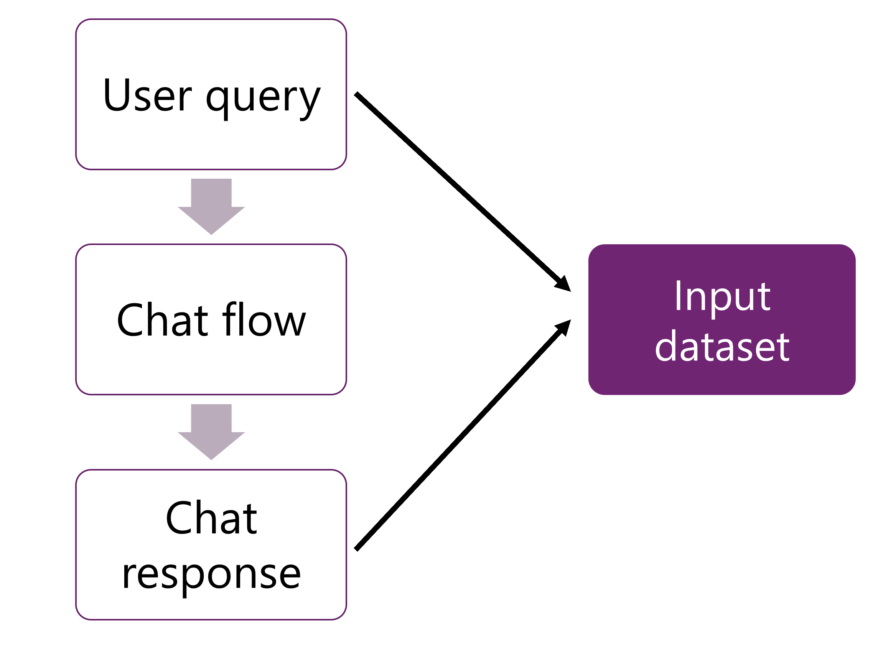

---
lab:
  title: Mengevaluasi performa copilot kustom Anda di Azure AI Foundry
---

# Mengevaluasi performa copilot kustom Anda di Azure AI Foundry

Dalam latihan ini, Anda akan menjelajahi evaluasi bawaan dan kustom untuk menilai dan membandingkan performa aplikasi AI Anda dengan portal Azure AI Foundry.

Latihan ini akan memakan waktu sekitar **30** menit.

## Membuat hub AI dan proyek di Azure AI Foundry

Anda mulai dengan membuat proyek Azure AI Foundry dalam hub Azure AI:

1. Di browser web, buka [https://ai.azure.com](https://ai.azure.com) dan masuk menggunakan kredensial Azure Anda.
1. Pilih halaman **Beranda** lalu pilih **+ Proyek baru**.
1. Di wizard **Buat proyek**, berikan nama unik untuk proyek Anda lalu pilih **Sesuaikan** dan atur pengaturan berikut ini:
    - **Nama hub**: *Nama unik*
    - **Langganan**: *Langganan Azure Anda*
    - **Grup sumber daya**: *Grup sumber daya baru*
    - **Lokasi**: Pilih **Bantu saya memilih** lalu pilih **gpt-35-turbo** di jendela Pembantu lokasi dan gunakan wilayah yang direkomendasikan\*
    - **Sambungkan Layanan Azure AI atau Azure OpenAI**: (Baru) *Autofills dengan nama hub yang Anda pilih*
    - **Menyambungkan Azure AI Search**: Lewati koneksi

    > \* Sumber daya Azure OpenAI dibatasi oleh kuota regional. Wilayah yang tercantum di pembantu lokasi mencakup kuota default untuk tipe model yang digunakan dalam latihan ini. Memilih wilayah secara acak akan mengurangi risiko satu wilayah mencapai batas kuota dalam skenario di mana Anda berbagi langganan dengan pengguna lain. Jika batas kuota tercapai di akhir latihan, Anda mungkin perlu membuat sumber daya lain di wilayah yang berbeda. Pelajari lebih lanjut tentang [ketersediaan model per wilayah](https://learn.microsoft.com/azure/ai-services/openai/concepts/models#gpt-35-turbo-model-availability)

1. Pilih **Berikutnya** dan tinjau konfigurasi Anda.
1. Pilih **Buat proyek** dan tunggu hingga prosesnya selesai.

## Sebarkan model GPT

Untuk menggunakan model bahasa dalam alur perintah, Anda perlu menyebarkan model terlebih dahulu. Azure AI Foundry memungkinkan Anda menerapkan model OpenAI yang dapat Anda gunakan dalam alur Anda.

1. Navigasikan ke halaman **Model + titik akhir** di bawah bagian **Aset saya**, menggunakan menu di sebelah kiri.
1. Pilih tombol **+ Sebarkan model** , dan pilih opsi **Sebarkan model dasar**.
1. Buat penyebaran baru model **gpt-35-turbo** dengan pengaturan berikut dengan memilih **Sesuaikan** di wizard **Sebarkan model**:
    - **Nama penyebaran**: *Nama unik untuk penyebaran model Anda*
    - **Tipe penyebaran**: Standar
    - **Versi model**: *Pilih versi default*
    - **Sumber daya AI**: *Pilih sumber daya yang dibuat sebelumnya*
    - **Batas Tarif Token Per Menit (ribuan)**: 5K
    - **Filter konten**: DefaultV2
    - **Aktifkan kuota dinamis**: Dinonaktifkan
1. Tunggu hingga aplikasi disebarkan. Saat penyebaran siap, pilih **Buka di playground**.
1. Dalam kotak teks **Berikan instruksi model dan konteks** , ubah konten menjadi yang berikut ini:

   ```
   **Objective**: Assist users with travel-related inquiries, offering tips, advice, and recommendations as a knowledgeable travel agent.

   **Capabilities**:
   - Provide up-to-date travel information, including destinations, accommodations, transportation, and local attractions.
   - Offer personalized travel suggestions based on user preferences, budget, and travel dates.
   - Share tips on packing, safety, and navigating travel disruptions.
   - Help with itinerary planning, including optimal routes and must-see landmarks.
   - Answer common travel questions and provide solutions to potential travel issues.
    
   **Instructions**:
   1. Engage with the user in a friendly and professional manner, as a travel agent would.
   2. Use available resources to provide accurate and relevant travel information.
   3. Tailor responses to the user's specific travel needs and interests.
   4. Ensure recommendations are practical and consider the user's safety and comfort.
   5. Encourage the user to ask follow-up questions for further assistance.
   ```

1. Pilih **Terapkan perubahan**.
1. Di jendela obrolan (riwayat), masukkan kueri: `What can you do?` untuk memverifikasi bahwa model bahasa berperilaku seperti yang diharapkan.

Sekarang setelah Anda memiliki model yang disebarkan dengan pesan sistem yang diperbarui, Anda dapat mengevaluasi model.

## Mengevaluasi model bahasa di portal Azure AI Foundry secara manual

Anda dapat meninjau respons model secara manual berdasarkan data pengujian. Peninjauan secara manual memungkinkan Anda menguji input yang berbeda satu per satu untuk mengevaluasi apakah model berfungsi seperti yang diharapkan.

1. Di **taman bermain Obrolan**, pilih menu dropdown **Evaluasi**  dari bilah atas, dan pilih **Evaluasi manual**.
1. Ubah **Pesan sistem** ke pesan yang sama seperti yang Anda gunakan di atas (sertakan di sini lagi):

   ```
   **Objective**: Assist users with travel-related inquiries, offering tips, advice, and recommendations as a knowledgeable travel agent.

   **Capabilities**:
   - Provide up-to-date travel information, including destinations, accommodations, transportation, and local attractions.
   - Offer personalized travel suggestions based on user preferences, budget, and travel dates.
   - Share tips on packing, safety, and navigating travel disruptions.
   - Help with itinerary planning, including optimal routes and must-see landmarks.
   - Answer common travel questions and provide solutions to potential travel issues.
    
   **Instructions**:
   1. Engage with the user in a friendly and professional manner, as a travel agent would.
   2. Use available resources to provide accurate and relevant travel information.
   3. Tailor responses to the user's specific travel needs and interests.
   4. Ensure recommendations are practical and consider the user's safety and comfort.
   5. Encourage the user to ask follow-up questions for further assistance.
   ```

1. Di bagian **Hasil evaluasi manual** Anda akan menambahkan lima input yang akan Anda tinjau outputnya. Masukkan lima pertanyaan berikut sebagai lima **Input**terpisah:

   `Can you provide a list of the top-rated budget hotels in Rome?`

   `I'm looking for a vegan-friendly restaurant in New York City. Can you help?`

   `Can you suggest a 7-day itinerary for a family vacation in Orlando, Florida?`

   `Can you help me plan a surprise honeymoon trip to the Maldives?`

   `Are there any guided tours available for the Great Wall of China?`

1. Pilih **Jalankan** dari bilah atas untuk menghasilkan output untuk semua pertanyaan yang Anda tambahkan sebagai input.
1. Anda sekarang dapat meninjau output secara manual untuk setiap pertanyaan dengan memilih ikon jempol ke atas atau bawah di kanan bawah respons. Beri peringkat setiap respons, memastikan Anda menyertakan setidaknya satu jempol ke atas dan satu respons jempol ke bawah dalam peringkat Anda.
1. Pilih **Simpan hasil** dari bilah menu atas. Masukkan `manual_evaluation_results` sebagai nama untuk hasilnya.
1. Menggunakan menu di sebelah kiri, navigasikan ke **Evaluasi**.
1. Pilih tab **Evaluasi manual** untuk menemukan evaluasi manual yang baru saja Anda simpan. Perhatikan bahwa Anda dapat menjelajahi evaluasi manual yang dibuat sebelumnya, melanjutkan di mana Anda pergi, dan menyimpan evaluasi yang diperbarui.

## Mengevaluasi salinan Anda dengan metrik bawaan

Ketika Anda telah membuat aplikasi obrolan dengan alur prompt, Anda dapat mengevaluasi alur tersebut dengan melakukan proses batch dan menilai kinerja alur tersebut dengan metrik bawaan.



Untuk mengevaluasi alur obrolan, kueri pengguna, dan respons obrolan disediakan sebagai input untuk evaluasi.

Untuk menghemat waktu, kami telah membuat kumpulan himpunan data output untuk Anda yang berisi hasil beberapa input yang sedang diproses oleh alur permintaan. Setiap hasil disimpan dalam himpunan data yang akan Anda evaluasi di langkah berikutnya.

1. Pilih tab **Evaluasi otomatis** dan buat **Evaluasi baru** dengan pengaturan berikut: <details>  
      <summary><b>Tips pemecahan masalah</b>: Kesalahan izin</summary>
        <p>Jika Anda menerima kesalahan izin saat membuat alur perintah baru, coba langkah berikut untuk memecahkan masalah:</p>
        <ul>
          <li>Di portal Azure, pilih Penjelajah Sumber Daya dari Semua Layanan.</li>
          <li>Pada tab Identitas di bawah Manajemen Sumber Daya, konfirmasikan bahwa itu adalah identitas terkelola yang ditetapkan sistem.</li>
          <li>Lakukan navigasi ke Akun Penyimpanan. Pada halaman IAM, tambahkan penetapan peran <em>Pembaca data blob penyimpanan</em>.</li>
          <li>Di bawah <strong>Tetapkan akses ke</strong>, pilih <strong>Identitas Terkelola</strong>, <strong>+ Pilih anggota</strong>, dan pilih <strong>Semua identitas terkelola yang ditetapkan sistem</strong>.</li>
          <li>Tinjau dan tetapkan untuk menyimpan pengaturan baru dan coba lagi langkah sebelumnya.</li>
        </ul>
    </details>

    - **Apa yang ingin Anda evaluasi?**: Himpunan data
    - **Nama evaluasi**: *Masukkan nama unik*
    - Pilih **Selanjutnya**
    - **Pilih data yang ingin Anda evaluasi**: Tambahkan himpunan data Anda
        - Unduh [himpunan data validasi](https://raw.githubusercontent.com/MicrosoftLearning/mslearn-ai-studio/main/data/travel-qa.jsonl) di `https://raw.githubusercontent.com/MicrosoftLearning/mslearn-ai-studio/main/data/travel-qa.jsonl`, simpan sebagai file JSONL dan unggah ke UI.
    - Pilih **Selanjutnya**
    - **Pilih metrik**: Koherensi, Kefasihan
    - **Koneksi**: *Koneksi Layanan AI Anda*
    - **Nama/Model penyebaran**: *Model GPT-3.5 yang Anda sebarkan*
    - **kueri**: Pilih **pertanyaan** sebagai sumber data
    - **respons**: Pilih **jawaban** sebagai sumber data
      
1. Pilih **Berikutnya** lalu tinjau data Anda dan **Kirimkan** evaluasi baru tersebut.
1. Tunggu hingga evaluasi selesai, Anda mungkin perlu menyegarkan.
1. Pilih eksekusi evaluasi yang baru saja Anda buat.
1. Jelajahi **Dasbor metrik** dan **Hasil metrik terperinci**.

## Menghapus sumber daya Azure

Setelah selesai menjelajahi Azure AI Foundry, Anda harus menghapus sumber daya yang telah Anda buat untuk menghindari biaya Azure yang tidak perlu.

- Navigasikan ke [portal Microsoft Azure](https://portal.azure.com) di `https://portal.azure.com`.
- Di portal Microsoft Azure, pada halaman **Beranda**, pilih **Grup sumber daya**.
- Pilih grup sumber daya yang telah Anda buat untuk latihan ini.
- Di bagian atas halaman **Gambaran Umum** untuk grup sumber daya, pilih **Hapus grup sumber daya**.
- Masukkan nama grup sumber daya untuk mengonfirmasi bahwa Anda ingin menghapusnya, dan pilih **Hapus**.
