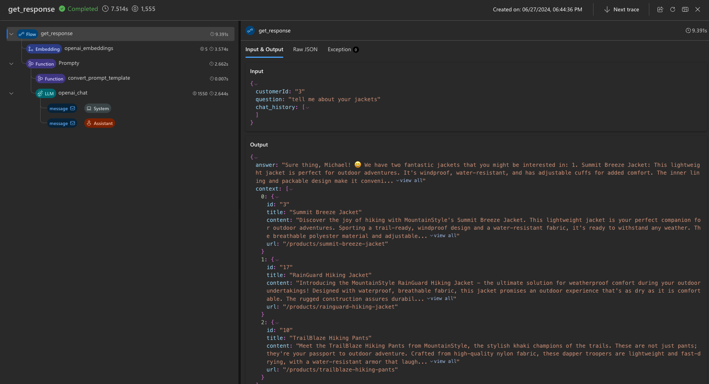

---
lab:
  title: Membangun salinan kustom menggunakan alat pengembangan code-first
---

# Membangun salinan kustom menggunakan alat pengembangan code-first

Dalam latihan ini, Anda akan mengkloning dan menyebarkan templat Azure Developer CLI yang menyediakan dan [menyebarkan proyek AI Anda ke titik akhir online](https://learn.microsoft.com/azure/developer/azure-developer-cli/azure-ai-ml-endpoints?WT.mc_id=academic-140829-cacaste) di Azure AI Studio. Anda kemudian akan menggunakannya sebagai titik awal untuk membangun salinan kustom Anda sendiri dengan Azure AI dan pengalaman kode-pertama.

Latihan ini akan memakan waktu sekitar **90** menit.

## Sebelum memulai

Untuk menyelesaikan latihan ini, Anda perlu:

- Akun GitHub untuk membuat fork repositori proyek dan mengujinya di lingkungan GitHub Codespaces. Buat akun gratis [di GitHub](https://github.com/).
- Tingkat dasar Azure AI Search untuk mengaktifkan Semantic Ranker. Pelajari selengkapnya tentang [detail harga Pencarian AI](https://azure.microsoft.com/pricing/details/search/).
- Untuk menyebarkan tiga model OpenAI (`gpt-35-turbo`, `gpt-4`, `text-embedding-ada-002`). Agar dapat menyebarkan model, Anda perlu membuat hub AI di wilayah dengan kuota yang memadai. Pelajari lebih lanjut tentang [ketersediaan model per wilayah](https://learn.microsoft.com/azure/ai-services/openai/concepts/models?WT.mc_id=academic-140829-cacaste#model-summary-table-and-region-availability)

## Memahami skenario

Untuk mulai menggunakan templat proyek Azure Developer CLI AI, navigasikan ke [Templat Azure AI dengan koleksi Azure Developer CLI](https://learn.microsoft.com/collections/5pq0uompdgje8d/?WT.mc_id=academic-140829-cacaste). Dengan menjelajahi koleksi, Anda dapat menemukan beberapa proyek yang dikelompokkan berdasarkan teknologi dan kasus penggunaan, termasuk sampel proyek multi-modal dan multi-agen, proyek seperti salinan, dan sampel yang mengintegrasikan kerangka kerja dan layanan Azure yang berbeda.

Untuk latihan ini, Anda akan mengambil **[salinan Contoso Chat Retail dengan templat proyek Azure AI Studio & PromptFlow (Python)](https://aka.ms/contoso-retail-sample)** sebagai titik awal Anda. Templat proyek ini adalah pengalaman pertama kode yang menggunakan Prompty dan PromptFlow untuk membangun salinan kustom (chat AI) yang dapat diintegrasikan ke dalam situs web ritel (chat UI) dari perusahaan fiksi bernama Contoso Outdoors.


Solusi salinan ritel menggunakan pola Retrieval Augmented Generation (RAG) untuk respons darat dalam produk perusahaan dan data pelanggan. Pelanggan dapat mengajukan pertanyaan chatbot ritel tentang katalog produk perusahaan, dan juga mendapatkan rekomendasi berdasarkan pembelian sebelumnya.

Dengan memilih tautan proyek yang disertakan dalam koleksi, Anda akan diarahkan ke repositori GitHub yang menghosting kode templat. File [README.md](https://github.com/Azure-Samples/contoso-chat/blob/main/README.md) di repositori memberikan deskripsi terperinci tentang proyek, termasuk arsitektur, prasyarat, dan langkah-langkah untuk menyebarkan proyek.


## Mengatur GitHub Codespaces

Dalam latihan ini Anda akan menggunakan [GitHub Codespaces](https://github.com/features/codespaces), fitur GitHub yang memungkinkan Anda meluncurkan [kontainer pengembangan](https://docs.github.com/codespaces/setting-up-your-project-for-codespaces/adding-a-dev-container-configuration/introduction-to-dev-containers) yang dihosting cloud yang telah dikonfigurasi sebelumnya langsung dari repositori Anda, dengan satu klik. Dengan cara ini, Anda dapat dengan cepat memulai pengodean tanpa harus menyiapkan lingkungan pengembangan lokal Anda, karena Codespaces sudah memiliki semua alat dan dependensi yang diperlukan yang telah diinstal sebelumnya.

Untuk menginisialisasi lingkungan pengembangan Anda, ikuti langkah-langkah di bawah ini:

1. **Fork repositori**: Pilih tombol **Fork** di sudut kanan atas halaman repositori GitHub untuk membuat salinan repositori di akun GitHub Anda.
1. Setelah Anda memiliki repositori fork, pilih tombol **Kode** dan pilih **Codespaces**.
1. Pilih tombol **+** untuk membuat codespace baru di cabang utama repositori fork Anda.

    

1. Dalam beberapa detik, Anda akan diarahkan ke tab browser baru di mana lingkungan Codespaces disiapkan dengan [editor Visual Studio Code terlampir](https://code.visualstudio.com/docs/devcontainers/containers) secara default. Anda dapat terus bekerja di tab browser, atau menyambungkan kembali ke Codespace yang sedang berjalan dari editor Visual Studio Code lokal Anda dengan mengklik tombol **Buka di Visual Studio Code Desktop** dari menu kiri atas.

## Menyambungkan lingkungan VS Code ke Azure

Langkah selanjutnya adalah menyambungkan lingkungan pengembangan lokal Anda dengan langganan Azure tempat Anda ingin menyebarkan proyek. Mulailah dengan membuka terminal baru di IDE Visual Studio Code Anda.

1. Pertama, verifikasi bahwa [versi terbaru](https://github.com/Azure/azure-dev/releases/tag/azure-dev-cli_1.9.3) Azure Developer CLI diinstal.
    ```bash
    azd version
    ```

1. Selanjutnya, masuk ke Akun Azure Anda dari terminal VS Code.

    ```bash
    azd auth login 
    ```

## Memprovisikan sumber daya Azure untuk proyek Anda

Setelah masuk, Anda siap untuk mulai menyediakan sumber daya Azure untuk proyek dalam langganan Anda. Anda dapat melakukannya di terminal VS Code yang sama dengan yang Anda gunakan untuk masuk.

1. Provisikan *dan sebarkan* aplikasi AI Anda menggunakan azd.

    ```bash
    azd up
    ```

1. Anda akan melihat perintah berikut: Tanggapi menggunakan panduan di bawah ini:
    - **Masukkan nama lingkungan baru:***Digunakan untuk membuat nama grup sumber daya Anda*.
    - **Pilih Langganan Azure yang akan digunakan**: *Pilih langganan yang memiliki akses ke model Azure OpenAI*.
    - **Pilih lokasi Azure yang akan digunakan**: *Pilih lokasi dengan kuota model yang tersedia*.

    > Gunakan [tabel ringkasan model dan ketersediaan wilayah](https://learn.microsoft.com/en-us/azure/ai-services/openai/concepts/models?WT.mc_id=academic-140829-cacaste#model-summary-table-and-region-availability) untuk menemukan wilayah yang Anda butuhkan. Misalnya, Anda dapat menggunakan `sweden central` sebagai lokasi Azure karena ini adalah wilayah di mana sebagian besar model Azure OpenAI tersedia.

## Validasikan provisi dengan menggunakan Portal Azure

Provisi dan penyebaran aplikasi AI menggunakan azd dapat memakan waktu 10 menit atau lebih untuk menyelesaikannya. Anda dapat melacak kemajuan dengan:

- Menampilkan Penyedia sumber daya di [Portal Azure](https://ms.portal.azure.com/). Cari grup sumber daya yang sesuai dengan nama lingkungan Anda. Pilih opsi **Penyebaran** di bilah sisi, lalu pantau status penyebaran sumber daya yang sedang dibuat.
- Mengunjungi portal [Azure AI Studio](https://ai.azure.com) . Masuk menggunakan akun Azure Anda. Cari hub AI yang sesuai dengan grup sumber daya di atas (Anda mungkin perlu menyegarkan beberapa kali). Pilih proyek AI yang tercantum, lalu pilih **Penyebaran** di bilah sampingnya untuk melacak status untuk model dan penyebaran aplikasi obrolan.

Mari kita jelajahi cara memvalidasi provisi sumber daya menggunakan Portal Azure.

1. Navigasikan ke [Portal Azure](https://ms.portal.azure.com/) di tab browser.
1. Masuk dan temukan grup sumber daya yang sesuai dengan nama langganan dan lingkungan yang Anda masukkan sebelumnya. Panel **Gambaran Umum** akan terlihat seperti ini:

    

1. Mari kita mulai dengan memverifikasi bahwa sumber daya [arsitektur Azure AI Studio](https://learn.microsoft.com/azure/ai-studio/concepts/architecture) telah dibuat. Gambar di bawah ini memberikan detail lebih lanjut tentang apa yang disediakan masing-masing sumber daya ini ke aplikasi AI kami.

    - **Hub Azure AI**: Sumber daya Azure tingkat atas. Menyediakan lingkungan kolaborasi untuk tim.
    - **Proyek Azure AI**: Turunan hub. Mengelompokkan komponen aplikasi untuk orkestrasi, kustomisasi.
    - **Layanan Azure AI**: Mengelola titik akhir model Anda.

    

1. Selanjutnya, mari kita verifikasi bahwa kita menyediakan dua sumber daya utama untuk mengimplementasikan pola desain [Retrieval Augmented Generation](https://learn.microsoft.com/azure/ai-studio/concepts/retrieval-augmented-generation) dengan menyimpan data produk dan pelanggan untuk pengambilan berbasis kueri.

    - **Layanan pencarian**: Untuk mengelola indeks pencarian untuk data katalog produk kami.
    - **Akun Azure Cosmos DB**: Untuk membuat database untuk data pesanan pelanggan kami.

1. Selanjutnya, kita dapat memvalidasi bahwa kita memiliki sumber daya pendukung untuk mengelola kebutuhan aplikasi AI kita:

    - **Application Insights**: Untuk mendukung pemantauan dan telemetri untuk aplikasi yang disebarkan.
    - **Registri Kontainer**: Untuk menyimpan dan mengelola gambar Docker yang digunakan dalam proyek, secara privat.
    - **Brankas kunci**: Untuk menyimpan rahasia proyek (kunci, kredensial) dengan aman.
    - **Akun penyimpanan**: Untuk menyimpan data yang terkait dengan manajemen proyek AI (termasuk log).
    - **Aturan peringatan detektor pintar**: Detektor anomali Application Insights (untuk permintaan).

1. Terakhir tetapi tidak kalah pentingnya, Anda akan melihat sumber daya baru dengan jenis **penyebaran online pembelajaran mesin**. Ini adalah sumber daya yang sesuai dengan titik akhir proyek Azure AI yang disebarkan (untuk salinan obrolan).

## Memvalidasi penyebaran menggunakan Azure AI Studio

Portal Azure membantu Anda mengelola sumber daya Azure yang mendasar untuk proyek Anda. Portal Azure AI Studio membantu Anda *membangun dan mengelola* proyek AI itu sendiri, menyeluruh, dari pemilihan model hingga penyebaran aplikasi. Perintah `azd up` harus telah menyelesaikan seluruh proses dari provisi model yang diperlukan, hingga menyebarkan dan menghosting titik akhir API salinan untuk penggunaan. Mari kita validasi bahwa aplikasi berfungsi seperti yang diharapkan.

1. Kunjungi halaman **Kelola** di [Azure AI Studio](https://ai.azure.com/manage) untuk melihat semua hub Azure AI di langganan Anda.
1. Pilih hub untuk grup sumber daya Anda untuk melihat semua proyek Azure AI di dalamnya.
1. Pilih proyek AI default di hub, lalu pilih **Penyebaran** di menu di sebelah kiri.
1. Di bawah **Penyebaran model**, verifikasi bahwa Anda memiliki Koneksi Azure OpenAI termasuk penyebaran:
    - **gpt-35-turbo**: Digunakan untuk penyelesaian obrolan, membentuk mesin obrolan inti.
    - **gpt-4**: Digunakan untuk evaluasi obrolan, khususnya alur yang dibantu AI.
    - **text-embedding-ada-002**: Digunakan untuk vektorisasi kueri & pencarian.
1. Verifikasi bahwa Anda memiliki titik akhir online pembelajaran mesin dengan:
    - **chat-model**: Penyebaran AI obrolan dengan *sumber daya titik akhir mloe-xxx* .

    

## Menguji penyebaran (di cloud) menggunakan Azure AI Studio

Untuk memvalidasi bahwa salinan yang disebarkan berfungsi, gunakan kemampuan playground pengujian bawaan di Azure AI Studio.


1. Di Azure AI Studio, dari daftar **Penyebaran aplikasi** pilih **penyebaran chat-deployment-xxxx** .
1. Pada halaman **Detail** aplikasi obrolan yang disebarkan, pilih tab **Uji** untuk mendapatkan antarmuka pengujian.

    Perhatikan bahwa tab **Detail** juga memiliki nilai `Target URI` dan `Key` yang dapat Anda gunakan dengan aplikasi front-end lainnya (misalnya situs web Contoso Outdoor) untuk mengintegrasikan asisten obrolan ini untuk interaksi pengguna dunia nyata.

1. Untuk saat ini, uji penyebaran salinan dengan **Input**pengujian berikut:

    ```bash
    {"question": "tell me about your hiking shoes", "customerId": "2", "chat_history": []}
    ```

Anda harus mendapatkan respons JSON yang valid dalam komponen output seperti yang ditunjukkan.


## Menguji penyebaran (secara lokal) menggunakan Visual Studio Code

Perintah **azd up** tidak hanya menyediakan dan menyebarkan aplikasi ke Azure, perintah ini juga *mengonfigurasi lingkungan lokal Anda* di Visual Studio Code untuk mendukung pengembangan, pengujian, dan iterasi lokal. Mari kita lihat ini.

1. Pertama, validasi bahwa lingkungan Visual Studio Code Anda telah disiapkan dengan benar. Cari file **config.json** di folder akar dan verifikasi bahwa file tersebut memiliki tiga properti yang ditentukan di bawah ini, dengan nilai yang valid.

    ```json
    {
        "subscription_id": "xxxxxxxxxxxxxxxx",
        "resource_group": "rg-xxxxxx",
        "workspace_name": "ai-project-xxxxxxx"
    }

    ```

1. Verifikasi bahwa file **.env** dibuat di folder akar Anda. Ini harus berisi daftar variabel lingkungan *dengan nilai yang diisi*.

    ```bash
    AZUREAI_HUB_NAME=
    AZUREAI_PROJECT_NAME=
    AZURE_CONTAINER_REGISTRY_ENDPOINT=
    AZURE_CONTAINER_REGISTRY_NAME=
    AZURE_COSMOS_NAME=
    AZURE_ENV_NAME=
    AZURE_KEY_VAULT_ENDPOINT=
    AZURE_KEY_VAULT_NAME=
    AZURE_LOCATION=
    AZURE_OPENAI_API_VERSION=
    AZURE_OPENAI_CHAT_DEPLOYMENT=
    AZURE_OPENAI_ENDPOINT=
    AZURE_OPENAI_NAME=
    AZURE_RESOURCE_GROUP=
    AZURE_SEARCH_ENDPOINT=
    AZURE_SEARCH_NAME=
    AZURE_SUBSCRIPTION_ID=
    AZURE_TENANT_ID=
    COSMOS_ENDPOINT=
    ```

1. Verifikasi bahwa Anda memiliki **alat Alur prompt** yang terinstal di lingkungan pengembangan Anda.

    ```bash
    pf version
    ```

1. Gunakan **alat uji alur pf** untuk menguji **aplikasi aliran fleksibel contoso_chat** secara lokal, dengan pertanyaan sampel di bawah ini. Perhatikan sintaks perintah untuk meneruskan input:

    ```bash
    pf flow test --flow ./contoso_chat --inputs question="tell me about your jackets" customerId="3" chat_history=[]
    ```

Anda seharusnya menerima respons seperti ini:


### Melihat jejak (secara lokal) menggunakan Visual Studio Code

1. Anda dapat melacak detail eksekusi Anda dengan bendera seperti yang `--ui` ditunjukkan di bawah ini.

    ```bash
    pf flow test --flow ./contoso_chat --inputs question="tell me about your jackets" customerId="3" chat_history=[] --ui
    ```

Perintah ini harus meluncurkan **tampilan jejak** di browser Anda (di tab baru) dengan tabel yang menyediakan detail tingkat tinggi tentang eksekusi pengujian tersebut termasuk latensi dan penggunaan token.


1. Pilih rekaman untuk diperluas ke tampilan pelacakan yang lebih detail yang memungkinkan Anda memeriksa detail alur yang lebih halus - dari data mentah (input, output) ke langkah-langkah alur individual dan komponen yang relevan (misalnya, templat perintah yang digunakan untuk LLM).



## Memahami basis kode Obrolan Contoso

Backend Azure Anda disediakan dan siap. Lingkungan pengembangan lokal Anda disiapkan dan dikonfigurasi untuk bekerja dengan backend Azure Anda. Sekarang, yang perlu Anda lakukan adalah mulai memodifikasi konten untuk menyesuaikan dan menyebarkan ulang versi aplikasi Anda sendiri. Mari kita lihat sekilas bagaimana basis kode disusun.

> Ini adalah daftar **repositori yang disederhanakan** menghilangkan beberapa file dan folder untuk kejelasan.

```bash
data/
    customer_info/  
        create-cosmos-db.ipynb      # Run notebook to upload data to Cosmos DB
        customer_info_1.json        # Example Customer info and orders file
        customer_info_2.json 
        ...
        ...
    product_info/   
        create-azure-search.ipynb   # Run notebook to index product data in AI Search
        products.csv                # Example Products data file

contoso_chat/                       # Main folder for application content
    ai_search.py                    # Search retrieval tool (for RAG design)
    chat.json                       # Example chat file (for Prompty template)
    chat.prompty                    # Chat asset (using Prompty format)
    chat_request.py                 # LLM request tool (for chat completion)
    flow.flex.yaml                  # Promptflow flex flow (define entry point)
    requirements.txt                # App dependencies (define runtime environment)

azure.yaml                          # Main configuration file for Azure Developer CLI  
infra/      
    ai.yaml                         # Define AI model deployments
    app/                            # Infrastructure-as-code config specific to app
    core/                           # Infrastructure-as-code config for core resources
    hooks/                          # Contains post-provisioning scripts
    main.bicep                      # Entry point for Bicep template used by azd
deployment/                         # ai.endpoint config files (named in azure.yaml)
    chat-deployment.yaml 
    chat-model.yaml  
    environment.yaml  

requirements.txt
```

Saat Anda ingin menyesuaikan kode:

- Jika Anda membuat perubahan aplikasi (dalam `contoso_chat/`) cukup jalankan `azd deploy` untuk menyebarkan ulang aplikasi ke backend yang disediakan sebelumnya. Tidak diperlukan langkah-langkah provisi ulang atau intervensi manual tambahan.
- Jika Anda membuat perubahan sumber daya (dalam `infra/` folder) maka jalankan `azd up` untuk memprovisikan ulang dan menyebarkan ulang aplikasi. Ini akan secara otomatis mengambil nilai konfigurasi anda sebelumnya dari `.azure/` dan memodifikasinya.

## Opsional: Menyesuaikan dan menyebarkan ulang salinan

Saatnya untuk membangun salinan kustom Anda sendiri. Berikut adalah beberapa hal yang dapat Anda jelajahi, untuk mencobanya.

Ingatlah untuk setiap opsi ini:

- Gunakan `azd deploy` untuk menyebarkan ulang aplikasi jika Anda hanya mengubah kode aplikasi.
- Gunakan `azd up` untuk memprovisikan ulang dan menyebarkan ulang aplikasi jika Anda mengubah konfigurasi sumber daya.

### Menyesuaikan data riwayat pelanggan dan pesanan

1. Tinjau data sampel di bawah **data/customer_info** untuk merasakan skema default.
1. Jelajahi buku catatan **data/create-cosmos-db.ipynb** untuk pendekatan kode-pertama untuk pembaruan data.
1. **Ubah** data sampel dan **jalankan** buku catatan untuk mengubah database Azure CosmosDB default.
1. **Sebarkan** ulang aplikasi. Coba pertanyaan pengujian untuk memvalidasi bahwa data pelanggan baru dikembalikan.

### Menyesuaikan data katalog produk

1. Tinjau data sampel di bawah **data/product_info/** untuk merasakan skema default.
1. Jelajahi buku catatan **create-azure-search.ipynb** untuk pendekatan code-first untuk mengindeks pembaruan.
1. **Ubah** data sampel dan **jalankan** buku catatan untuk mengubah indeks Pencarian Azure AI default.
1. **Sebarkan** ulang aplikasi. Coba pertanyaan pengujian untuk memvalidasi bahwa data produk baru dikembalikan.

### Sesuaikan templat perintah

1. Tinjau file **contoso_chat/chat.prompty** untuk merasakan templat prompt default.
1. Tinjau **contoso_chat/chat.json** untuk memahami skema data sampel untuk pengujian.
1. **Ubah** templat (pesan sistem, keamanan, dokumentasi, atau instruksi).
1. **Ubah** contoh data jika diperlukan.
1. **Gunakan** Promptflow CLI untuk menguji alur secara lokal dengan templat prompt baru.
1. **Instal dan gunakan** ekstensi Prompty untuk membuat templat perintah baru dari awal.

### Menjelajahi evaluasi dan otomatisasi alur

Ganti himpunan data pengujian yang digunakan untuk menjalankan alur evaluasi aplikasi melalui GitHub Actions dengan data Anda sendiri. Himpunan data pengujian terletak di folder **data** proyek, dan dalam format **.jsonl** .

1. Ganti file himpunan data pengujian dengan data Anda sendiri.
1. Kemudian, jalankan alur evaluasi dengan mendorong perubahan ke cabang utama repositori fork Anda.

    Alur evaluasi akan berjalan secara otomatis, dan Anda dapat memeriksa hasilnya di tab Tindakan GitHub di repositori Anda.

1. Anda dapat menyesuaikan alur evaluasi dengan memodifikasi file **evaluate.yaml** di folder **github/workflows** proyek dan skrip **evaluations_chat.py** di folder **evaluasi** .

## Membersihkan dan menghapus sumber daya Azura

Proyek ini menggunakan model dan layanan (misalnya Pencarian Azure AI) yang dapat dikenakan biaya yang tidak sepele jika dibiarkan berjalan dalam jangka panjang. Setelah selesai menjelajahi templat Azure AI AZD ini, Anda harus menghapus sumber daya yang telah Anda buat untuk menghindari biaya Azure yang tidak perlu. Anda dapat melakukannya dengan menjalankan perintah berikut di terminal VS Code:

```bash
azd down
```

Ini tidak hanya membalikkan langkah-langkah yang diambil untuk memprovisikan dan menyebarkan aplikasi, tetapi juga mengambil langkah tambahan untuk *membersihkan* sumber daya yang mungkin disimpan dalam status "penghapusan sementara", yang memengaruhi kemampuan Anda untuk menggunakan kembali nama sumber daya atau mengklaim kembali kuota model. **Perintah ini akan meminta Anda tentang tindakan ini selama pematian - jadi pastikan Anda merespons dengan benar**.
